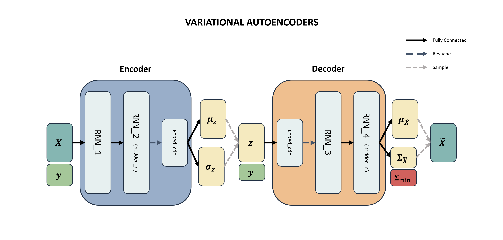

# Synthetic-Financial-Data-Generator

**An Industry Project for Capstone Credit**
Research Team: *Kaichong Wang, Qiaofei Liu, Jiacheng Wu* | Project Advisor: *Ruslan Tepelyan*
In collaboration with *Bloomberg L.P.* and *New York University Tandon School of Engineering*

https://synthetic-financial-data-generator.streamlit.app/)

## Key Highlights
🤖 Innovative Financial Data Generator: Our novel RNN-based VAE model simulates multivariate quarterly financial data time series for a sector over the course of a year.

🎉 Enhanced Realism and Usability: Compared to traditional methods, our model produces more realistic synthetic samples with a user-friendly interface.

📊 Insights for Trading and Risk Management: Analyzing synthetic sample patterns provides valuable insights for alpha trading strategies and risk management, extendable to diverse datasets.

## Summary
This study presents a generative model based on a variational autoencoder (VAE) for quarterly financial data time series. The model simulates the financials of a synthetic company for four quarters within a selected sector for a year. This innovative approach uses a recurrent neural network-based variational autoencoder that effectively captures both multivariate distributions and time dependencies present in the data. Compared to the traditional Multivariate Normal Monte Carlo Model and Multivariate Gaussian State Space Model, the synthetic samples generated by our model are more realistic, exhibiting better visual fidelity and lower discriminative scores. The derivative model includes control over a conditional channel that enables the generation of samples with predefined future performance, in addition to the main model. Our product was developed with a user-friendly interface. Analyzing the patterns and characteristics of the synthetic samples can yield valuable insights into alpha factor trading and risk management strategies. The extension of our model to different datasets holds the potential to further enhance these findings.

---
**✏️ Please refer to the project_report.pdf and Capstone_Project.ipynb for details**
